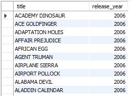
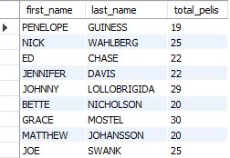

## Evaluación final módulo 2 SQL: Base de datos Sakila

Este repositorio es un ejercicio del Bootcamp de Adalab, en el que se muestra el aprendizaje y manejo de SQL. A través de la base de datos Sakila, vamos a hacer unas consultas (querys) a diferentes tablas conectadas entre sí. Las consultas en este caso son para extraer información específica sobre películas, actores, clientes o alquileres.

Este repositorio contiene un archivo SQL con consultas que responden a preguntas como:

- ¿Cuáles son las películas más largas?

- ¿Qué actores han participado en más películas?

- ¿Cuántas películas ha alquilado cada cliente?

- ¿Cuáles son las películas de comedia con una duración mayor a 3 horas?

### Aquí se muestran algunos ejemplos de consultas realizadas:

Todas las películas que fueron lanzadas entre el año 2005 y 2010.

~~~
SELECT title, release_year
FROM film
WHERE release_year BETWEEN 2005 AND 2010;
~~~

Resultado SQL:

Nombre y apellido de los actores que aparecen en más de 10 películas.

~~~
SELECT a.first_name, a.last_name, COUNT(fa.film_id) AS total_pelis
FROM actor a
JOIN film_actor fa ON a.actor_id = fa.actor_id
GROUP BY a.actor_id
HAVING COUNT(fa.film_id) > 10;
~~~

Resultado SQL:

